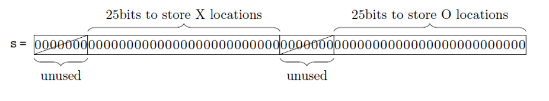
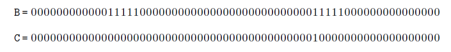
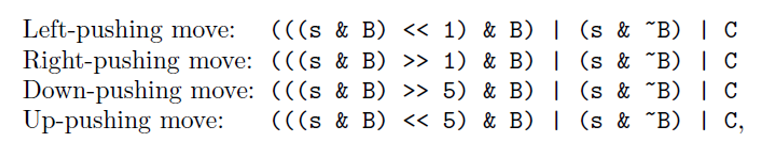

# quixo_private
State of art
Before starting we did some research to better understand the game and quixo strategies.
Once we had documented about the game we moved on to improve our knowledge of reinforcement-learning algorithms and how these could be applied to the game of quixo.
We found different articles about these topics, the most useful was probably “Quixo is solved” Satoshi Tanaka, François Bonnet, Sébastien Tixeuil & Yasumasa Tamura, the article is downloadable from this link: https://arxiv.org/abs/2007.15895 and the relative github repository is available at this link: https://github.com/st34-satoshi/quixo-cpp

Here we discovered some interesting things. For example there is an interesting way to represent the states that minimizes the memory occupied for each one. It also uses shift operations to perform the movements on the board (that produce the changes of the state) which are faster than functions that have to cycle through a matrix representation of the state.

This representation only requires 8 bytes: 25 bits for each symbol (O or X) and 7+7 are unused, as it is possible to observe in the image below.

B and C in the image below are other 8 bytes that the authors used to perform the move.

From the image above it is possible to observe how the moves are executed.
Initially we had thought about realizing something similar but there was a problem that came up: the amount of time needed to train the model was about 2 weeks.
Hence, we evaluated other options and in our opinion the best one was using the min-max algorithm (even if it is not a RL approach) with some adjustments (more info in Min-max section)

Q-Learning
Introduction
At first we tried emulating what we have seen in the state of art research by developing a Q-Learning algorithm.
In our experience with Tic-Tac-Toe, it took 6 minutes to train an agent which stored around 3k different states, so before starting developing the code we focused on understanding if it could be a feasible solution.

Q-Learning without an initial state
Standard version of Quixo includes a 5 x 5 board, which makes a total of 25 tiles.
Each tile can be empty, X or O.
This makes  different states which is something around 1600 billions.
It was clearly not feasible so we started thinking about a different approach.

Q-Learning with an initial state
We realized that once the game board is fully covered, a tile cannot have an empty state anymore, this would reduce the complexity of the algorithm drastically, passing from  to  which is about 66 million possible states.
To start filling the board we thought about mixing our Q-Learning agent with a min-max agent or a fixed rule agent which could quickly fill the board in order to activate our Q-Learning agent.
66 million is still a lot though, if we managed to train a Tic-Tac-Toe agent in 6 minutes filling 3000 states, this would require at least 90 days in a single-threaded environment

Final considerations
We went a bit further with initial constraints in order to try to reduce the number of possible states.
In our final attempt we noticed that once the board is filled, the number of X and O cannot be changed.
So starting from a full board (i.e. 13 X and 12 O) we have  possible states which is around 10  millions. 
We realized this was still a really high number and too many things could have gone wrong, that’s why in the end we decided to proceed with a min-max strategy.

Min Max
Introduction
First of all, we searched for some resources online and we found an implementation of a min-max algorithm to solve tic-tac-toe game. (https://stackabuse.com/minimax-and-alpha-beta-pruning-in-python/). We tried to adjust this code to quixo, naturally for a 5x5 quixo board it was too big also for min max approach, so we started changing the quixo code provided to us to scale the board (3x3 and 4x4). 
So we tested it on a 3x3 board and we obtained excellent results. We implemented the pruning strategy (alpha-beta strategy) to reduce the execution time (it reduced the execution time from 5 s to 0,5 s).

From 3x3 board to 5x5 board
The challenge involved transitioning from a 3x3 to a 5x5 board. To address this, we implemented a "depth" strategy within the min-max algorithm. This strategy, as implied by its name, limits the exploration to a certain depth within the tree of potential subsequent moves. It's crucial to note that, unlike tic-tac-toe, there's a possibility of never reaching a leaf node due to the risk of getting stuck in an infinite loop. While this method is relatively quick and yields fairly impressive outcomes against a random player, our satisfaction with the results was still not complete...

Smarter agents
Although the current model already wins against the random player, it doesn’t work well against the human player. So to evaluate the reward of the min and the max functions we introduced some heuristics to improve the choice of the agent. These heuristics evaluate different amounts of each player’s symbol, the number of 4-equal symbols for each row and column and the owner of the center tile of the board. Thanks to these heuristics the agent started to play in a clever way.
Final agent
Despite the big improvements we could do more, in fact we noticed that sometimes the agent preferred to block the victory of the opponent who would have won with the next move rather than making the winning move for himself. To solve this problem it was enough to give higher scores to victories with lower depth. Moreover we also took into consideration the quantity of symbols for each player in the diagonals and also the number of 2 or 3 identical symbols on the same line for each line. In conclusions we evaluated higher scores for moves that allowed the insertion of new pieces rather than moving those already present on the board.

